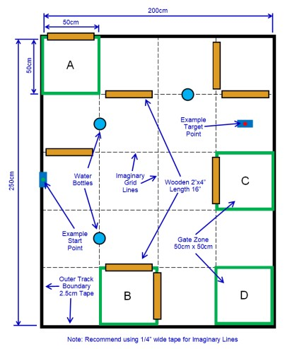

# Robot Tour 2025-26

A PlatformIO-based robotic control system for the Pololu Romi 32U4 robot platform. Designed around the 2025-26 Science Olympiad Robot Tour event rules.

## About Science Olympiad Robot Tour

**Robot Tour** is a Division C Science Olympiad event where teams design, build, program, and test an autonomous robotic vehicle to navigate a specified track and reach a target location as accurately and efficiently as possible within a set time limit.

> [!IMPORTANT]
> **READ THE LATEST SCIOLY HANDBOOK BEFORE USING THIS CODE** Check for maximum dimensions, weight limits, autonomous requirements, and allowed components.

### Key Objectives
- Navigate a custom track with varying complexity
- Reach target zones accurately and efficiently
- Minimize error distance and time
- Design and calibrate a reliable autonomous system
- Optimize for consistency across multiple trial runs

### Example Track


## Hardware

### Romi 32U4 Control Board
- **Microcontroller**: Pololu A-Star 32U4 (ATmega32U4) - USB-enabled AVR with Arduino bootloader
- **Motor Drivers**: Two H-bridge drivers for dual motor control
- **Power Regulation**: 5V switching step-down regulator (up to 2A continuous)
- **Sensors**: 
  - 3-axis accelerometer
  - 3-axis gyroscope
  - **Encoder Interface**: Quadrature encoder connectors (12 CPR magnetic encoders)
- **User Interface**: Three pushbuttons, indicator LEDs, buzzer, optional LCD connector
- **Connectivity**: USB micro-B for programming/debugging, Raspberry Pi interface with I²C level shifters
- **Power Supply**: 6 AA batteries (supports alkaline or NiMH rechargeable)

### Romi Chassis
- **Platform**: Differential-drive mobile robot base
- **Dimensions**: 6.5" diameter (165 mm) circular base
- **Motors**: Two Mini Plastic Gearmotors (120:1 HP with offset output and extended motor shaft)
- **Wheels**: 70×8mm Pololu wheels (white, included)
- **Wheel Base**: Dual drive wheels with fixed rear ball caster (70mm diameter)
- **Optional**: Front ball caster kit available for additional support
- **Weight Capacity**: Designed for small sensors, expansion plates, and optional robot arm
- **Mounting**: Abundant M2, M3, #2-56, and #4-40 mounting holes for electronics and accessories

## Key Features

### Chassis Control
- Forward and backward movement with configurable distance
- Left and right 90° turns
- PID-based motor synchronization for straight movement
- Gyroscope-based turn angle verification
- Speed multipliers for loaded (bottle-carrying) state

### Movement System
- Command-based movement sequences (e.g., "F32 L F R F B")
- Commands:
  - `F` / `b` - Forward/Backward (50 cm default, number specifies cm)
  - `L` / `R` - Turn Left/Right (90°)
  - `S` / `E` - Start/End distance movements
  - `B` - Pick up bottle (enables load compensation)
  - `N` - Drop bottle (disable load compensation)

### Load Compensation
When carrying a bottle, the system automatically adjusts:
- Drive speed multiplier: Normal scaling
- Turn speed multiplier: 40% reduction for stability
- Friction compensation: Encoder count adjustments for accuracy

## Configuration

### Motor PID Tuning
Edit in `main.cpp`:
```cpp
chassis.setMotorPIDcoeffs(4.45, .3);  // P = 4.45, I = 0.3
```

### Calibration
Key calibration constants in `main.cpp`:
- `NIGHTY_LEFT_TURN_COUNT`: Left turn encoder offset (-718)
- `NIGHTY_RIGHT_TURN_COUNT`: Right turn encoder offset (713)
- `Chassis` parameters: wheelDiam (6.994936972), ticksPerRevolution (1440), wheelTrack (14.0081)

> [!IMPORTANT]
> **Measure your own calibration values - don't copy these.**
> - Use **calipers** to measure wheel diameter (3 points, average them)
> - Encoder offsets are highly surface-dependent - recalibrate at tournament venue
> - Even ±1mm wheel error compounds massively over 50cm distances

### Movement Sequences
Modify the `moves[]` string in `main.cpp` to define robot behavior:
```cpp
char moves[200] = "F32 L F R F B F R R F F L F L F F F L F F F45 L F F F L F N b b L F F F b b R F40";
```

## Building and Uploading

### Build
```bash
platformio run
```

### Upload
```bash
platformio run --target upload
```

### Monitor Serial
```bash
platformio device monitor
```

## Usage

1. Power on the robot
2. Press button A to start executing the programmed movement sequence
3. Monitor serial output (115200 baud) for debug information
4. Modify movement commands in `main.cpp` and re-upload as needed


